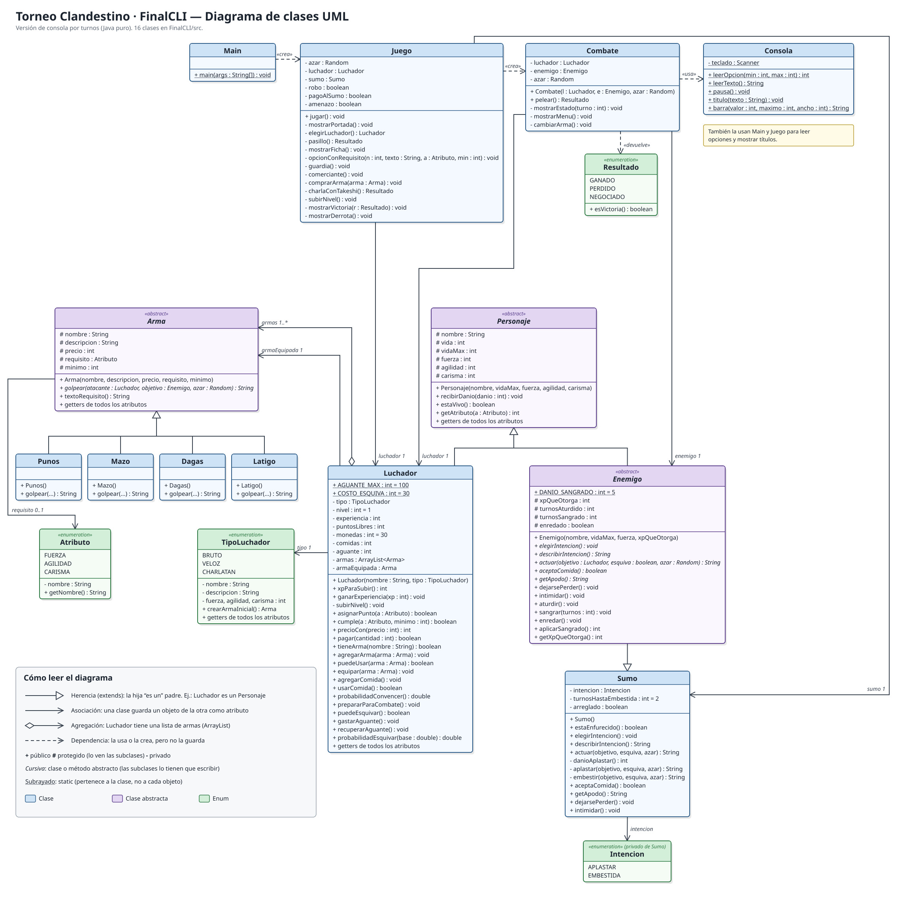
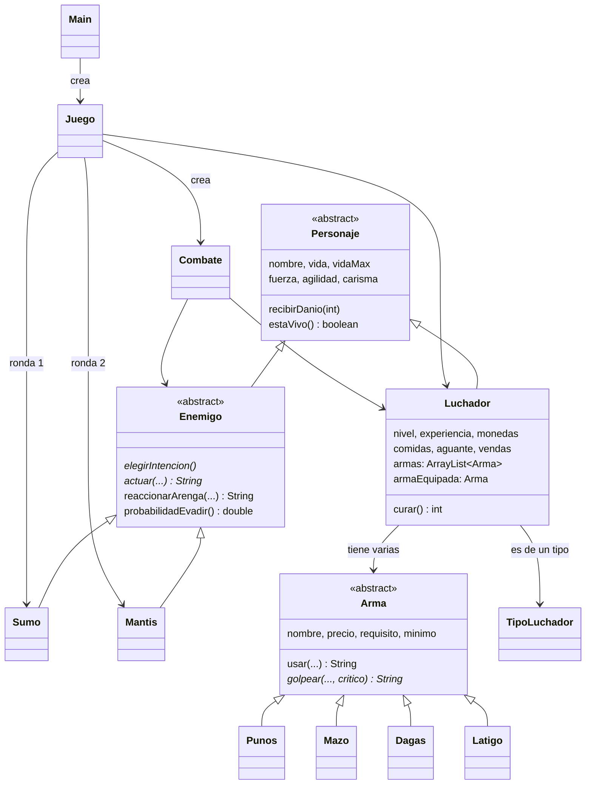
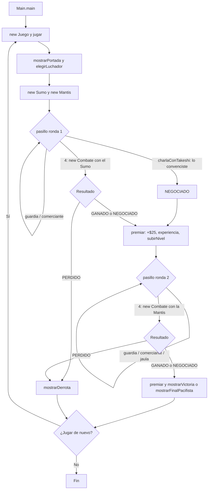

# Torneo Clandestino — TP Final de Informática I

Guía completa, paso a paso y sin dar nada por sabido, de la versión de consola del TP Final de Informática I. Explica **cómo ejecutar el juego**, **cómo se juega** y, sobre todo, **cómo funciona el código por dentro**.

> Si solo querés jugar, leé las secciones 1 a 4. Si querés entender el código (por ejemplo, para defender el TP), seguí con la 5 en adelante.
> 
## Índice

1. [¿Qué es esto?](#1-qué-es-esto)
2. [Qué necesitás antes de empezar](#2-qué-necesitás-antes-de-empezar)
3. [Cómo ejecutarlo](#3-cómo-ejecutarlo)
4. [Cómo se juega](#4-cómo-se-juega)
5. [Los archivos del proyecto](#5-los-archivos-del-proyecto)
6. [El recorrido del programa, de principio a fin](#6-el-recorrido-del-programa-de-principio-a-fin)
7. [Clase por clase](#7-clase-por-clase)
8. [Un turno de combate, paso a paso](#8-un-turno-de-combate-paso-a-paso)
9. [Conceptos de POO que usa el código](#9-conceptos-de-poo-que-usa-el-código)
10. [Todos los números del juego](#10-todos-los-números-del-juego)
11. [Cómo modificar el juego](#11-cómo-modificar-el-juego)
12. [Problemas comunes](#12-problemas-comunes)
13. [Glosario](#13-glosario)

---

## 1. ¿Qué es esto?

Es un juego **por turnos** que se juega **en la terminal** (la ventana negra donde se escriben comandos). No tiene gráficos, pero sí **colores**: todo es texto.

La historia: entrás a un torneo clandestino de **dos rondas**.

1. **Ronda 1 — Takeshi "La Montaña"**, un luchador de sumo enorme. Le podés ganar:
   - **peleando** turno a turno,
   - **convenciéndolo** con palabras de que no pelee,
   - **dándole un onigiri** (una bola de arroz) para que se distraiga comiendo,
   - **pagándole** para que se deje ganar, o
   - **amenazándolo** para que arranque la pelea más débil.
2. **Ronda 2 — Sor Tijereta, la Mantis Religiosa Gigante.** Es rapidísima y no se puede hablar con ella. Pero es muy devota: si hacés cantar a la tribuna, se arrodilla a rezar.

Si ganás las dos rondas (de cualquier forma), salís **VICTORIOSO**.

Está hecho con **Java puro**: no usa Maven ni ninguna librería externa.

---

## 2. Qué necesitás antes de empezar

Solo necesitás **Java 17 o más nuevo** (el JDK, que trae los comandos `javac` y `java`).

### ¿Ya lo tengo instalado?

Abrí una terminal y escribí:

```bash
java -version
javac -version
```

Si aparece algo como `openjdk version "17.0.20"` (o un número mayor, como 21), ya está. Si dice **"command not found"** o **"no se reconoce como un comando"**, hay que instalarlo:

| Sistema | Cómo instalar Java |
|---|---|
| Arch Linux | `sudo pacman -S jdk17-openjdk` |
| Ubuntu / Debian | `sudo apt install openjdk-17-jdk` |
| Windows / Mac | Descargar el instalador de [Adoptium](https://adoptium.net/) (Temurin 17 o 21) y seguir los pasos |

> **Ojo:** tienen que funcionar **los dos** comandos. `java` sirve para ejecutar, pero `javac` (el compilador) solo viene en el **JDK**, no en el JRE.

### Cómo abrir la terminal en la carpeta del juego

Todos los comandos de abajo se escriben **parado en la carpeta `TPfinal`** (la que tiene este README):

- **Linux / Mac:** abrí la terminal y escribí `cd ` (con espacio) y la ruta de la carpeta, por ejemplo:
  ```bash
  cd ~/Descargas/UPA/Informatica1/TPfinal
  ```
  También podés hacer clic derecho sobre la carpeta → "Abrir en una terminal".
- **Windows:** abrí la carpeta en el Explorador de archivos, hacé clic en la barra de direcciones, escribí `cmd` y apretá Enter.

Para comprobar que estás en el lugar correcto, escribí `ls` (Linux/Mac) o `dir` (Windows): tenés que ver `jugar.sh`, `jugar.bat`, `README.md` y la carpeta `src`.

---

## 3. Cómo ejecutarlo

### Opción A — con el script (lo más fácil)

```bash
./jugar.sh          # Linux / Mac
jugar.bat           # Windows (o doble clic sobre el archivo)
```

Si en Linux dice **"Permiso denegado"**, usá `sh jugar.sh` o dale permiso una vez con `chmod +x jugar.sh`.

### Opción B — a mano, paso por paso

El script hace exactamente estos dos pasos:

```bash
javac -encoding UTF-8 -d out src/*.java
java -cp out Main
```

Qué significa cada parte:

| Parte del comando | Qué hace |
|---|---|
| `javac` | El **compilador**: traduce los `.java` (texto que escribimos) a `.class` (código que entiende la máquina virtual de Java) |
| `-encoding UTF-8` | Le avisa que los archivos tienen tildes y eñes, para que no las rompa |
| `-d out` | Guarda los `.class` en una carpeta `out/` (así no se mezclan con el código) |
| `src/*.java` | Compila **todos** los archivos `.java` de la carpeta `src` |
| `java` | Ejecuta el programa ya compilado |
| `-cp out` | *classpath*: le dice a Java que busque los `.class` en la carpeta `out` |
| `Main` | La clase donde está el `main`, es decir, **por dónde arranca** el programa |

> La carpeta `out/` se crea sola al compilar. No hace falta subirla ni entregarla (está en el `.gitignore`).

### Colores (y cómo apagarlos)

El juego usa colores: la vida en **verde**, **amarillo** o **rojo** según cuánto te quede, el aguante en celeste, los críticos en amarillo y el daño que recibís en rojo.

Si en tu terminal aparecen cosas raras como `←[32m` en vez de colores (pasa en el `cmd` viejo de Windows), jugá sin colores:

```bash
./jugar.sh --sin-color          # Linux / Mac
jugar.bat --sin-color           # Windows
java -cp out Main --sin-color   # a mano
```

> En Windows 10/11 los colores se ven bien en **Windows Terminal** (la terminal nueva, que viene instalada en Windows 11).

### Cómo se contesta

El juego siempre muestra opciones numeradas y un `>` esperando que escribas. **Escribís el número y apretás Enter.** Si escribís algo que no es un número, o un número fuera de rango, te lo vuelve a pedir:

```
> hola
Elegí un número entre 1 y 4.
> 9
Elegí un número entre 1 y 4.
> 2
```

Cuando aparece `(Enter para seguir)`, solo apretá Enter. Para salir en cualquier momento: **Ctrl + C**.

---

## 4. Cómo se juega

### Paso 1 — Nombre y luchador

Primero escribís tu nombre de pelea (si lo dejás vacío, te llamás **"Errante"**). Después elegís uno de tres luchadores:

| Luchador | Fuerza | Agilidad | Carisma | Vida | Arma inicial | Estilo |
|---|---|---|---|---|---|---|
| 1) El Bruto | **8** | 3 | 3 | 140 | Mazo | Pega muy fuerte |
| 2) La Sombra | 3 | **8** | 3 | 115 | Dagas | Esquiva mucho y hace sangrar |
| 3) El Charlatán | 3 | 3 | **8** | 115 | Látigo | Gana hablando (y cantando) |

Todos arrancan con **$30**, **0 onigiris**, los **Puños** y su arma inicial.

### Paso 2 — El pasillo

Antes de cada ronda estás en el pasillo, con este menú (se repite hasta que entrás al ring o ganás hablando):

```
[Gonza | El Charlatán | Nv 1 | Vida 115 | F 3 A 3 C 8 | $30 | Arma: Látigo | Comida: 0 | Vendas: 2]

1) Hablar con el guardia
2) Ver el carrito del comerciante
3) Hablar con Takeshi a través de la reja      (en la ronda 2: Acercarte a la jaula de la mantis)
4) Entrar al ring y pelear
```

La línea entre corchetes es tu **ficha**: nombre, tipo, nivel, vida, atributos (F = Fuerza, A = Agilidad, C = Carisma), plata, arma equipada, onigiris y las vendas con las que vas a entrar a la próxima pelea.

Algunas opciones tienen un **requisito**, escrito así: `[Carisma 6]`. Significa "necesitás Carisma 6 o más". Si no te alcanza, la opción aparece igual pero con **(no te alcanza)** al final, y elegirla no sirve de nada.

**El guardia** (te da pistas sobre el rival de la ronda):

| Opción | Requisito | Ronda 1 (Takeshi) | Ronda 2 (la mantis) |
|---|---|---|---|
| Preguntar | — | Te explica el torneo | Te cuenta qué es esa cosa |
| Invitarle algo | Carisma 6 | La embestida se puede esquivar y Takeshi acepta comida | **Si la tribuna canta, la mantis se arrodilla a rezar**; con tres himnos se va |
| Mirarlo fijo | Fuerza 6 | No te quedes quieto cuando carga | Ataca dos veces seguidas y hay que esquivar su abrazo |

**El comerciante** (compras):

| Opción | Qué pasa |
|---|---|
| Mazo / Dagas / Látigo | Comprás el arma **y queda equipada**. Necesitás el atributo que pide (6 o más) y la plata. No te deja comprar un arma que ya tenés |
| Onigiri gigante | Sumás un onigiri |
| Venda | Sumás una venda para curarte en combate. Se agrega a las 2 que te dan gratis en cada pelea |
| Manotear un onigiri | **Agilidad 6**: te lo llevás gratis. Solo **una vez** por partida |

Los precios bajan con tu Carisma (5 % por punto, hasta 40 %). Ver la [tabla de precios](#precios).

**Takeshi, a través de la reja** (solo en la ronda 1; la forma de ganar sin pelear):

| Opción | Requisito | Qué pasa |
|---|---|---|
| Convencerlo | Carisma 7 | **Ganás directamente**, sin pelear |
| Pasarle un onigiri | Tener un onigiri | Lo gasta. Con suerte (según tu Carisma) **ganás sin pelear**; si no, lo tira al piso |
| Ofrecerle plata | Tener la plata | Se deja ganar: arranca la pelea con **solo el 30 % de su vida**, no hace embestidas y se tropieza mucho más. Solo una vez |
| Amenazarlo | Fuerza 7 | Arranca la pelea con **20 % menos de vida**. Solo una vez |

> **Truco:** El Charlatán puede ganar la ronda 1 en dos jugadas: `3` (hablar con Takeshi) y `1` (convencerlo).

**La jaula de la mantis** (solo en la ronda 2): con ella **no se puede hablar**. Le decís algo, gira la cabeza y hace *clic-clic*. Si tenés **Agilidad 6**, te das cuenta de cómo avisa su ataque más fuerte.

### Paso 3 — La pelea por turnos

Al elegir **4) Entrar al ring**, empieza la pelea. Cada turno se ve así:

```
----------------- Turno 2 -----------------
Gonza        Vida    [####################] 140/140
             Aguante [####################] 100/100
Takeshi      Vida    [#################---] 172/200

>> ¡Takeshi baja la cabeza y raspa el piso con el pie! Prepara una EMBESTIDA (40 % de tu vida).

1) Atacar con Mazo (Mucho daño, 40 % de aturdir (pierde el turno))
2) Esquivar (gasta 30 de aguante)
3) Vendarse (cura el 30 % de tu vida, te quedan 2)
4) Arengar a la tribuna
5) Ofrecer comida (tenés 0)
6) Cambiar de arma (no gasta el turno)
```

- Las **barras** muestran la vida y el aguante: cada `#` es una parte llena y cada `-` una parte vacía. La de vida cambia de color: **verde**, **amarilla** con el 60 % o menos y **roja** con el 30 % o menos.
- La línea que empieza con `>>` es **lo que el rival va a hacer este turno**. Te avisa *antes* de que elijas, así podés decidir si atacar, esquivar o curarte.

**Lo que podés hacer vos:**

| Acción | Qué hace | ¿Gasta el turno? |
|---|---|---|
| 1) Atacar | Golpea con el arma equipada (ver [armas](#arma-y-sus-4-hijas)). **20 % de crítico: daño doble** | Sí |
| 2) Esquivar | Gasta 30 de aguante y tenés chance de que el ataque no te toque | Sí |
| 3) Vendarse | Recuperás el **30 % de tu vida máxima**. Tenés 2 vendas gratis por pelea, más las que compres | Sí |
| 4) Arengar a la tribuna | Contra Takeshi: el público te alienta y recuperás 15 de aguante. **Contra la mantis: ver abajo** | Sí |
| 5) Ofrecer comida | Gasta un onigiri. Si lo acepta, **ganás** (la mantis nunca acepta) | Sí (si no lo acepta) |
| 6) Cambiar de arma | Elegís otra arma de las que tenés y podés usar | **No** |

**El aguante:** empieza en 100. Esquivar cuesta 30 y necesitás al menos 30 para hacerlo. Cada turno en que **no** esquivás recuperás `10 + tu Agilidad`. Si esquivás muchas veces seguidas te quedás "sin aire" y no podés esquivar hasta recuperarte.

**Golpes críticos:** cualquier golpe (tuyo o del rival) tiene **20 % de chance** de ser crítico y hacer **el doble de daño**. Se avisa con **¡CRÍTICO!** en amarillo. Los ataques especiales que sacan un porcentaje de tu vida (la embestida y el abrazo) no hacen crítico.

#### Ronda 1: Takeshi "La Montaña"

| Ataque | Cuándo | Daño | Detalle |
|---|---|---|---|
| **Aplastar** | Casi siempre | 18 (24 si está furioso) | 1 de cada 4 veces se **tropieza**, no te pega y pierde el turno siguiente |
| **Embestida** | Cada 3 turnos (turnos 2, 5, 8…) | **40 % de tu vida máxima** | Si la esquivás, se estrella contra las cuerdas y pierde el turno siguiente |

Cuando le queda **menos de la mitad de vida** (menos de 100) se pone **¡FURIOSO!**: pega más fuerte y embiste cada 2 turnos.

**Consejo:** atacá cuando dice **APLASTARTE** y esquivá cuando dice **EMBESTIDA**.

#### Ronda 2: Sor Tijereta, la Mantis Religiosa Gigante

Tiene menos vida que Takeshi (170), pero es **muy rápida**:

| Ataque | Cuándo | Daño | Detalle |
|---|---|---|---|
| **Dos tijeretazos** | Casi siempre | 10 **cada uno** (dos por turno) | Si esquivás, cada golpe se esquiva por separado |
| **Abrazo mortal** | Cada 3 turnos (turnos 3, 6, 9…) | **30 % de tu vida máxima** | Si lo esquivás, queda hecha un nudo de patas y pierde el turno siguiente |

Además **esquiva el 30 % de tus ataques** ("tu golpe corta el aire").

**Cómo ganarle con carisma:** no se puede hablar con ella ni sobornarla con comida, pero es muy religiosa. Con **4) Arengar a la tribuna** intentás que el público cante un himno:

- La chance es **10 % por punto de Carisma** (máximo 90 %). El Charlatán arranca con 80 % (y 90 % si al subir de nivel pone los puntos en Carisma); El Bruto y La Sombra, con 30 %, casi nunca llegan.
- **Si sale:** se arrodilla a rezar, **no te ataca en ese turno** y sube su **Fervor** (se ve al lado de su barra, por ejemplo `Fervor 2/3`).
- **Con Fervor 3:** tiene una revelación, suelta las pinzas y se va del ring a hacerse monja. **Ganás la ronda sin pelear.**
- **Si falla:** la tribuna te chifla y ella ataca normalmente.

**Consejo:** si tu Carisma es bajo, peleá: esquivá cuando abre las patas (el abrazo), vendate cuando la barra se ponga roja y comprá vendas extra antes de entrar.

La pelea termina cuando la vida de alguno llega a 0 (o cuando el rival acepta la comida o se va del ring).

### Paso 4 — Premio, subir de nivel y final

Cada vez que ganás una ronda (peleando o no):

- cobrás la **bolsa de la pelea: +$25**, para gastar en el comerciante antes de la siguiente;
- ganás experiencia y **subís de nivel**: +10 de vida máxima y **2 puntos** para repartir entre Fuerza, Agilidad y Carisma. Takeshi te lleva a nivel 2 y la mantis a nivel 3.

Al ganar las dos rondas aparece la pantalla **V I C T O R I O S O**, que cuenta cómo ganaste cada una. Si perdés cualquiera de las dos, aparece **D E R R O T A**. En los dos casos te pregunta si querés jugar de nuevo; si decís que sí, **todo arranca de cero**.

**Final secreto — F I N A L   P A C I F I S T A:** si ganás **las dos rondas sin pelear** (a Takeshi convenciéndolo o con un onigiri, a la mantis con los tres himnos) y **nunca elegiste "Atacar" ni amenazaste a Takeshi**, en vez de la pantalla normal aparece un final especial. Sobornar a Takeshi sí se permite (es plata, no violencia). Ojo: alcanza con un solo "Atacar", aunque erres el golpe, para perderlo; en ese caso la pantalla de victoria te avisa "Casi...".

### Una partida real, completa

Esta es una partida del Charlatán ganando el torneo sin pelear (los números después de `>` son lo que escribió el jugador; se recortaron algunas partes con `...`):

```
> 3                  (elige a El Charlatán)
...
3) Hablar con Takeshi a través de la reja
> 3
1) [Carisma 7] Convencerlo de que pelear con vos no le suma nada
> 1
Le hablás de su leyenda, de su dignidad, de lo poco que ganaría aplastando a alguien como vos.
Takeshi se ríe y se sienta. —Tenés razón. Pasá, campeón.

  ¡Le ganaste a Takeshi!
El organizador te tira la bolsa de la pelea: +$25.
  ¡Subiste a nivel 2!
...
  El pasillo de la Fosa - Ronda 2
...
4) Entrar al ring y pelear
> 4
  ¡PELEA! Gonza vs Sor Tijereta, la Mantis Religiosa Gigante

----------------- Turno 1 -----------------
Gonza        Vida    [####################] 125/125
             Aguante [####################] 100/100
Sor Tijereta Vida    [####################] 170/170

>> Sor Tijereta afila las pinzas una contra otra: va a lanzar DOS TIJERETAZOS.
> 4
Arrancás un himno y la tribuna lo sigue. Sor Tijereta se arrodilla y junta las patas a rezar. (Fervor 1/3)
Sor Tijereta se persigna con una pinza (casi se corta sola) y sigue rezando.

----------------- Turno 2 -----------------
...
> 4
¡La tribuna canta "Aleluya"! Sor Tijereta se queda dura, se persigna y se pone a rezar. (Fervor 2/3)
Sor Tijereta murmura un rosario entero con los ojos cerrados. Ni te mira.

----------------- Turno 3 -----------------
...
>> ¡Sor Tijereta abre las patas delanteras de par en par! Prepara un ABRAZO MORTAL (30 % de tu vida).
> 4
La tribuna entera canta un Aleluya a coro. Sor Tijereta suelta las pinzas, levanta la vista
al techo, llora y se va del ring caminando despacio: dice que la llamó el convento.
...
  V I C T O R I O S O
Gonza salió del Ring de la Fosa como campeón del torneo.
  Ronda 1, Takeshi:      sin tirar una sola piña
  Ronda 2, Sor Tijereta: la mandaste de vuelta al convento
Nivel 3 | Fuerza 3 | Agilidad 3 | Carisma 12
```

---

## 5. Los archivos del proyecto

```
TPfinal/
├── README.md          Este archivo
├── jugar.sh           Script para compilar y jugar en Linux / Mac
├── jugar.bat          Script para compilar y jugar en Windows
├── diagrama_clases.jpg  Diagrama de clases UML completo
├── out/               (se crea al compilar) los .class
└── src/               El código fuente: 17 archivos .java
    ├── Main.java          Punto de entrada: arranca el juego y pregunta si jugar de nuevo
    ├── Juego.java         Una partida: elección, las dos rondas, pasillo, compras, premios y final
    ├── Combate.java       El bucle de turnos de la pelea
    ├── Consola.java       Leer lo que escribe el usuario, colores, títulos, barras y frases al azar
    │
    ├── Personaje.java     (abstracta) Lo que tienen en común todos los que pelean
    ├── Luchador.java      El personaje del jugador
    ├── Enemigo.java       (abstracta) Lo que tienen en común los rivales
    ├── Sumo.java          Takeshi "La Montaña", el rival de la ronda 1
    ├── Mantis.java        Sor Tijereta, la Mantis Religiosa Gigante, rival de la ronda 2
    │
    ├── Arma.java          (abstracta) Lo que tienen en común las armas (esquiva del rival y crítico)
    ├── Punos.java         Puños
    ├── Mazo.java          Mazo
    ├── Dagas.java         Dagas
    ├── Latigo.java        Látigo
    │
    ├── Atributo.java      (enum) FUERZA, AGILIDAD, CARISMA
    ├── TipoLuchador.java  (enum) Los 3 luchadores con sus números iniciales
    └── Resultado.java     (enum) GANADO, PERDIDO, NEGOCIADO
```

Todas las clases están en la misma carpeta y **sin `package`**: por eso se compilan todas juntas con `src/*.java`.

### Cómo se relacionan las clases

El diagrama de clases UML completo (con atributos, métodos y visibilidad) está en [`diagrama_clases.jpg`](diagrama_clases.jpg):



Versión resumida:

Las flechas con triángulo (`<|--`) significan "**es un**" (herencia): un `Luchador` *es un* `Personaje`. Las otras flechas significan "**tiene / usa**".



> Si tu visor de Markdown no dibuja el diagrama (por ejemplo, un editor de texto común), abrí el archivo en GitHub o en VS Code con una extensión de Mermaid. El diagrama es solo una ayuda: todo está explicado también con texto.

---

## 6. El recorrido del programa, de principio a fin

Esto es lo que pasa **en orden** desde que ejecutás `java -cp out Main` hasta que termina:



Contado con palabras:

1. **`Main.main`** es lo primero que corre. Si recibió `--sin-color`, apaga los colores. Después tiene un `while` que crea un `Juego` nuevo y llama a `jugar()`. Al terminar la partida pregunta "¿Jugar de nuevo?". Como cada vuelta crea un `new Juego()`, **todo vuelve a cero** (luchador, plata, rivales).
2. **`Juego.jugar()`** es el guion de una partida:
   1. Muestra la portada y `elegirLuchador()` crea el `Luchador`.
   2. Crea los dos rivales: `sumo = new Sumo()` y `mantis = new Mantis()`.
   3. Llama a `pasillo(1)`, que **no devuelve nada hasta que la pelea de esa ronda se resuelve**. Devuelve un `Resultado`.
   4. Si perdió, muestra la derrota y hace `return` (la partida termina). Si ganó, `premiar(sumo)`: bolsa de plata, experiencia y reparto de puntos.
   5. Lo mismo con `pasillo(2)` y la mantis.
   6. Si ganó las dos, `mostrarFinalPacifista()` si fueron las dos `NEGOCIADO` sin atacar ni amenazar nunca; si no, `mostrarVictoria(ronda1, ronda2)`.
3. **`pasillo(ronda)`** es un `while (true)` con el menú de 4 opciones. Las opciones 1 y 2 hacen algo y vuelven al menú. La 3 depende de la ronda: en la 1 es la charla con Takeshi (que puede terminar la ronda si lo convencés); en la 2 es mirar la jaula de la mantis. La 4 crea un `Combate` contra el rival de la ronda y devuelve lo que devuelva la pelea.
4. **`Combate.pelear()`** es otro `while (true)` que repite turnos hasta que la pelea termina (ver la [sección 8](#8-un-turno-de-combate-paso-a-paso)).

Un detalle importante: el `return` adentro de un `while (true)` es **la única forma de salir** del bucle. Por eso `pasillo()` y `pelear()` terminan justo cuando hacen `return` de un `Resultado`.

---

## 7. Clase por clase

### `Main` — el punto de entrada

```java
public static void main(String[] args) {
    for (String arg : args) {
        if (arg.equals("--sin-color")) {
            Consola.desactivarColores();
        }
    }

    boolean seguir = true;
    while (seguir) {
        new Juego().jugar();
        System.out.println("\n¿Jugar de nuevo?  1) Sí   2) No");
        seguir = Consola.leerOpcion(1, 2) == 1;
    }
    System.out.println("¡Hasta la próxima!");
}
```

- `args` son las palabras que se escriben después de `Main` al ejecutar. El `for` las recorre buscando `--sin-color`.
- `seguir = Consola.leerOpcion(1, 2) == 1;` se lee así: "leé una opción entre 1 y 2; si es 1, `seguir` vale `true`; si no, `false`".
- Es muy corta a propósito: toda la lógica está en las otras clases.

### `Consola` — hablar con el usuario

Tiene **solo métodos `static`**: no hace falta crear un objeto `Consola`, se usan directamente como `Consola.leerOpcion(1, 4)`. Comparte un único `Scanner` (el que lee el teclado) para todo el programa.

| Método | Qué hace |
|---|---|
| `leerOpcion(min, max)` | Muestra `> `, lee una línea y la convierte a número con `Integer.parseInt`. Si no es un número (salta `NumberFormatException`) o está fuera de rango, avisa y **vuelve a pedir** (está dentro de un `while (true)`). Solo sale cuando el número es válido |
| `leerTexto()` | Lee una línea de texto (se usa para el nombre). `trim()` le saca los espacios de los costados |
| `pausa()` | Muestra "(Enter para seguir)" y espera un Enter |
| `titulo(texto)` | Dibuja un título entre dos líneas de `=` del largo justo |
| `barra(valor, maximo, ancho)` | Arma las barras tipo `[####----] 80/140` |
| `barraVida(valor, maximo, ancho)` | La misma barra, pintada de verde, amarillo o rojo según el porcentaje |
| `color(texto, codigo)` | Devuelve el texto pintado con ese color (o igual, si los colores están apagados) |
| `desactivarColores()` | Apaga los colores (lo usa `Main` con `--sin-color`) |
| `alAzar(opciones, azar)` | Elige una frase al azar de un arreglo, para que los textos no se repitan siempre iguales |

**Cómo se calcula la barra:** si tenés 70 de 140 de vida y la barra mide 20, la cantidad de `#` es `70 / 140 × 20 = 10`. Se completa con `-` hasta llegar a 20:

```java
int llenos = (int) Math.round((double) valor / maximo * ancho);
return "[" + "#".repeat(llenos) + "-".repeat(ancho - llenos) + "] " + valor + "/" + maximo;
```

El `(double)` es importante: sin él, `70 / 140` entre enteros daría `0` y la barra estaría siempre vacía.

**Cómo funcionan los colores:** la terminal entiende unas secuencias especiales, los **códigos ANSI**. Por ejemplo, `"\u001B[32m"` significa "desde acá, escribí en verde" y `"\u001B[0m"` significa "volvé al color normal". `\u001B` es un carácter invisible llamado ESC. Por eso `color()` hace:

```java
return codigo + texto + RESET;   // por ejemplo: ESC[32m + "[####----] 80/140" + ESC[0m
```

Y `barraVida()` elige el color comparando porcentajes **sin dividir** (para no tener problemas con la división entera):

```java
if (valor * 100 <= maximo * 30) {        // 30 % o menos
    codigo = ROJO;
} else if (valor * 100 <= maximo * 60) { // 60 % o menos
    codigo = AMARILLO;
} else {
    codigo = VERDE;
}
```

`valor * 100 <= maximo * 30` es lo mismo que `valor / maximo <= 30 %`, pero con multiplicaciones de enteros, que son exactas.

**Por qué `hasNextLine()`:** si la entrada se cierra (por ejemplo con Ctrl + D en Linux), `hasNextLine()` da `false` y el programa termina con `System.exit(0)` en vez de romperse con un error.

### `Personaje` — la base de todos los que pelean

Es una clase **abstracta**: no se puede hacer `new Personaje(...)`. Existe para no repetir en `Luchador` y en `Enemigo` lo que tienen en común:

- **`PROB_CRITICO = 0.20`**: la constante del golpe crítico. Está acá porque la usan **los dos lados** (las armas del jugador y los ataques de los rivales).
- **Atributos** `protected` (los ven las clases hijas): `nombre`, `vida`, `vidaMax`, `fuerza`, `agilidad`, `carisma`.
- **El constructor** arranca con la vida al máximo (`this.vida = vidaMax`).
- **`recibirDanio(danio)`** resta vida sin bajar de 0: `vida = Math.max(0, vida - danio)`. Si tenés 10 y te pegan 18, quedás en 0 (no en -8).
- **`estaVivo()`** devuelve `vida > 0`.
- **`getAtributo(Atributo)`** devuelve el valor del atributo que le pidas con un `switch`. Así, en vez de preguntar "¿es fuerza?, ¿es agilidad?…" en muchos lugares, se escribe `getAtributo(Atributo.CARISMA)`.

### `Luchador` — el jugador

Hereda de `Personaje` (`extends Personaje`) y agrega todo lo propio del jugador.

**Constantes** (`static final`, es decir, fijas y compartidas):

```java
public static final int AGUANTE_MAX = 100;
public static final int COSTO_ESQUIVA = 30;
public static final int VENDAS_POR_PELEA = 2;
```

**El constructor** recibe el nombre y el `TipoLuchador` elegido:

```java
super(nombre, 100 + tipo.getFuerza() * 5, tipo.getFuerza(), tipo.getAgilidad(), tipo.getCarisma());
```

`super(...)` llama al constructor de `Personaje`. La vida máxima se calcula como `100 + Fuerza × 5` (por eso El Bruto tiene 140 y los otros 115). Después le da los Puños y el arma inicial del tipo, y deja equipada esa arma.

Los métodos están agrupados en tres bloques:

**Niveles**

| Método | Qué hace |
|---|---|
| `xpParaSubir()` | Experiencia necesaria: `nivel × 100` |
| `ganarExperiencia(xp)` | Suma experiencia y, mientras alcance, sube de nivel |
| `subirNivel()` | **`private`**: +1 nivel, +10 de vida máxima, se cura del todo y +2 puntos libres. Es privado para que **nadie pueda subir de nivel sin ganar experiencia** |
| `asignarPunto(atributo)` | Gasta un punto libre en el atributo. Si no hay puntos, devuelve `false` y no hace nada |
| `cumple(atributo, minimo)` | `true` si el atributo es mayor o igual al mínimo. Es **la** función de los requisitos `[Carisma 6]` |

**Plata, armas, comida y vendas**

| Método | Qué hace |
|---|---|
| `precioCon(precio)` | Aplica el descuento por carisma: 5 % por punto, máximo 40 % |
| `pagar(cantidad)` | Si no alcanza la plata devuelve `false` **y no cobra nada**. Si alcanza, descuenta y devuelve `true` |
| `ganarMonedas(cantidad)` | Suma plata (la bolsa de cada ronda ganada) |
| `tieneArma(nombre)` | Recorre la lista de armas y compara los nombres con `.equals()` |
| `puedeUsar(arma)` | `true` si el arma no tiene requisito (`null`) o si lo cumplís |
| `equipar(arma)` | Solo la equipa si la podés usar |
| `agregarComida()` / `usarComida()` | Suma o resta un onigiri. `usarComida()` devuelve `false` si no tenías ninguno |
| `agregarVenda()` | Suma una venda comprada |
| `getVendas()` | Las vendas que podés usar **ahora**, en medio de la pelea |
| `getVendasParaPelear()` | Con cuántas vas a entrar a la próxima pelea (las 2 gratis más las compradas). Es lo que muestra la ficha del pasillo |
| `curar()` | Gasta una venda y recupera el 30 % de la vida máxima, sin pasarse. Devuelve cuánto curó |
| `probabilidadConvencer()` | 12 % por punto de carisma; con carisma 8 o más, 100 % |

**Las vendas usan dos contadores:** `vendasDePelea` (las 2 gratis, que se reponen en cada pelea) y `vendasCompradas` (que se guardan entre peleas). `curar()` gasta **primero las gratis**, porque esas igual se pierden al terminar la pelea:

```java
if (vendasDePelea > 0) {
    vendasDePelea--;
} else {
    vendasCompradas--;
}
int cura = Math.min((int) Math.round(vidaMax * 0.3), vidaMax - vida);
vida += cura;
```

El `Math.min` hace que no te cures más de lo que te falta: si te faltan 20 de vida, curás 20 (no el 30 % entero).

**Combate**

| Método | Qué hace |
|---|---|
| `prepararParaCombate()` | Vida y aguante al máximo, y 2 vendas gratis, antes de pelear |
| `puedeEsquivar()` | `aguante >= 30` |
| `gastarAguante()` | Resta 30 (sin bajar de 0) |
| `recuperarAguante()` | Suma `10 + agilidad` (usa `sumarAguante`) |
| `sumarAguante(cantidad)` | Suma aguante sin pasar de 100 (lo usa también la arenga contra Takeshi) |
| `probabilidadEsquivar(base)` | `base + agilidad × 5 %`, con un tope de 95 % para que nunca sea seguro |
| `marcarViolencia()` / `usoLaViolencia()` | Bandera del final pacifista: pasa a `true` la primera vez que atacás o amenazás, y nunca vuelve a `false` |

Fijate un patrón que se repite: **los métodos que pueden fallar devuelven `boolean`** (`pagar`, `usarComida`, `asignarPunto`). Así quien los llama puede escribir `if (luchador.pagar(10)) { ... } else { "No te alcanza" }`, y el objeto nunca queda en un estado inválido (por ejemplo, con plata negativa).

### `Enemigo` — la base de los rivales

También es **abstracta** y hereda de `Personaje`. Define **qué tiene que saber hacer cualquier rival**, aunque no diga *cómo*. Eso son los métodos `abstract` (sin cuerpo, terminan en `;`):

```java
public abstract void elegirIntencion();
public abstract String describirIntencion();
public abstract String actuar(Luchador objetivo, boolean jugadorEsquiva, Random azar);
public abstract boolean aceptaComida();
public abstract String reaccionarComida(boolean aceptada, Random azar);
public abstract String getApodo();
```

Cada rival concreto (`Sumo` y `Mantis`) **está obligado** a escribirlos. Si no, el código no compila.

Además tiene métodos **con un comportamiento por defecto**, que cada rival puede redefinir (`@Override`) si quiere reaccionar distinto:

| Método | Por defecto | Quién lo redefine |
|---|---|---|
| `dejarsePerder()` / `intimidar()` | No hacen nada | `Sumo` |
| `probabilidadEvadir()` | `0.0`: no esquiva tus golpes | `Mantis` (30 %) |
| `textoEvasion(azar)` | Un texto genérico | `Mantis` |
| `reaccionarArenga(luchador, azar)` | Al rival no le afecta, pero la tribuna te da 15 de aguante | `Mantis` (se pone a rezar) |
| `abandonoLaPelea()` | `false` | `Mantis` (con 3 de fervor) |
| `estadoExtra()` | `""` (nada al lado de la barra) | `Sumo` ("¡FURIOSO!") y `Mantis` ("Fervor 2/3") |

Y los **estados alterados** que le causan las armas, que son iguales para todos los enemigos:

| Estado | Lo causa | Atributo | Efecto |
|---|---|---|---|
| Aturdido | Mazo (y los tropiezos de Takeshi) | `turnosAturdido` | Pierde su próxima acción |
| Sangrado | Dagas | `turnosSangrado` | `aplicarSangrado()` le saca 5 al final de cada turno, durante 3 turnos |
| Enredado | Látigo | `enredado` | 50 % de perder su próximo ataque |

Por último, dos ayudas `protected` para las subclases: `tiraCritico(azar)` (el mismo 20 % que el jugador) y `textoDanio(danio)`, que devuelve el daño en rojo (`"-18"`).

### `Sumo` — Takeshi "La Montaña"

Hereda de `Enemigo`. Se crea con 200 de vida, 10 de fuerza y da 100 de experiencia:

```java
super("Takeshi", 200, 10, 100);
```

Tiene un **enum privado** con sus dos ataques: `APLASTAR` y `EMBESTIDA`. Guarda la `intencion` del turno, un contador `turnosHastaEmbestida` (arranca en 2) y `arreglado` (si le pagaste).

- **`estaEnfurecido()`**: `true` si no está arreglado y tiene menos de la mitad de vida. `estadoExtra()` lo usa para mostrar "¡FURIOSO!".
- **`elegirIntencion()`**: al principio de cada turno resta 1 al contador. Cuando llega a 0, elige `EMBESTIDA` y reinicia el contador en 3 (o en 2 si está furioso). Si no, elige `APLASTAR`. Si está arreglado, nunca embiste.

  Con el contador en 2: turno 1 → queda en 1 → aplasta. Turno 2 → llega a 0 → **embiste** y vuelve a 3. Turno 3 → 2, turno 4 → 1, turno 5 → 0 → **embiste**. Por eso las embestidas caen en los turnos 2, 5, 8…
- **`describirIntencion()`**: el texto del aviso (`>>`). Si está aturdido, avisa que no puede atacar.
- **`actuar(...)`**: su turno, revisado **en este orden**:
  1. Si está aturdido: pierde el turno.
  2. Si está enredado: 50 % de perder el ataque (el enredo se consume igual).
  3. Si eligió embestida → `embestir(...)`. Si no → `aplastar(...)`.
- **`aplastar(...)`**: primero tira el dado del tropiezo (25 %, o 60 % si está arreglado). Si se tropieza, no pega y queda aturdido. Si no, y vos esquivaste, tira tu chance de esquivar (base 55 %). Si nada de eso pasó, te saca 18 (o 24 furioso), **con 20 % de crítico** (36 o 48).
- **`embestir(...)`**: si esquivaste y te sale la chance (base 40 %), se estrella y queda aturdido. Si no, te saca el 40 % de **tu** vida máxima. No hace crítico.
- **`reaccionarComida(...)`**: si acepta, se sienta a comer; si no, pisa el onigiri.
- **`dejarsePerder()`**: `arreglado = true` y baja su vida al 30 % (60).
- **`intimidar()`**: le saca el 20 % de la vida máxima (40).

### `Mantis` — Sor Tijereta, la Mantis Religiosa Gigante

Hereda de `Enemigo`. Se crea con 170 de vida, 8 de fuerza y da 200 de experiencia (lo que hace falta para pasar de nivel 2 a 3):

```java
super("Sor Tijereta", 170, 8, 200);
```

Tiene su propio enum privado (`TIJERETAZOS` y `ABRAZO`), una cuenta regresiva `turnosHastaAbrazo` (arranca en 3), el `fervor` (himnos exitosos) y `rezando` (si pierde su próxima acción por estar rezando).

- **Es rápida, y eso se ve en tres lugares:**
  - `actuar(...)` llama a `tijeretazo(...)` **dos veces** y junta los textos con `"\n"`. Cada tijeretazo se esquiva por separado (base 45 %) y puede ser crítico.
  - `probabilidadEvadir()` devuelve `0.30`: `Arma.usar()` lo consulta antes de cada golpe tuyo.
  - Cada 3 turnos (el 3, el 6…) elige `ABRAZO`: el 30 % de tu vida máxima (base 35 % para esquivarlo). Si lo esquivás, queda aturdida.
- **`actuar(...)`** revisa en este orden: rezando → aturdida → enredada → abrazo o tijeretazos.
- **`reaccionarArenga(...)`**, la forma de ganarle con carisma:
  1. La chance es `Math.min(0.9, carisma * 0.10)`.
  2. Si falla, devuelve el texto de la tribuna chiflando y no cambia nada.
  3. Si sale, `fervor++`. Si llegó a 3, devuelve el texto de la revelación. Si no, `rezando = true` (pierde su próxima acción).
- **`abandonoLaPelea()`**: `fervor >= 3`. `Combate` lo pregunta después de tu acción y, si es `true`, termina la pelea con `Resultado.NEGOCIADO`.
- **`aceptaComida()`** devuelve siempre `false`: con ella no se negocia.

### `Arma` y sus 4 hijas

`Arma` es **abstracta** y guarda lo común: `nombre`, `descripcion`, `precio`, `requisito` (un `Atributo`, o `null` si no pide nada) y `minimo`.

Tiene un método **normal** (con cuerpo), `usar()`, que es el que llama `Combate`. Hace lo que es igual para todas las armas:

```java
public String usar(Luchador atacante, Enemigo objetivo, Random azar) {
    if (azar.nextDouble() < objetivo.probabilidadEvadir()) {
        return objetivo.textoEvasion(azar);          // 1) el rival esquivó
    }
    boolean critico = azar.nextDouble() < Personaje.PROB_CRITICO;  // 2) ¿crítico?
    String texto = golpear(atacante, objetivo, azar, critico);     // 3) el golpe de cada arma
    if (critico) {
        texto = Consola.color("¡CRÍTICO! ", Consola.AMARILLO + Consola.NEGRITA) + texto;
    }
    return texto;
}
```

Y un método **abstracto**, `golpear()`, que cada arma escribe **a su manera**. Recibe `critico` y, si es `true`, duplica su daño:

```java
public abstract String golpear(Luchador atacante, Enemigo objetivo, Random azar, boolean critico);
```

Así la esquiva y el crítico están escritos **una sola vez** (en `usar`), y cada arma solo se ocupa de su golpe.

| Clase | Requisito | Precio base | `golpear()` hace |
|---|---|---|---|
| `Punos` | ninguno | 0 | Daño `4 + Fuerza / 2` |
| `Mazo` | Fuerza 6 | 25 | Daño `12 + Fuerza × 2` y 40 % de `aturdir()` |
| `Dagas` | Agilidad 6 | 25 | Dos cortes de `2 + Agilidad / 2` y `sangrar(3)` |
| `Latigo` | Carisma 6 | 25 | Daño `6 + Carisma / 3` y `enredar()` |

> Las divisiones son **entre enteros**, así que se redondea para abajo: con Fuerza 3, `3 / 2` da `1` (no 1,5).

Cada `golpear()` tiene un arreglo de 3 frases y elige una con `Consola.alAzar(...)`, usando el nombre del rival. Devuelve un `String` con lo que pasó (por ejemplo, *"Girás con todo el peso del cuerpo y el mazo se hunde en las costillas de Takeshi: -28."*), y es `Combate` quien lo imprime. Así las armas no dependen de cómo se muestra el texto.

`textoRequisito()` arma el texto `"[Fuerza 6]"` que se ve en la tienda (o `""` si el arma no tiene requisito).

### Los tres `enum`

Un `enum` es un tipo con **una lista cerrada de valores posibles**. Sirve para que no se pueda escribir cualquier cosa (por ejemplo, un atributo `"Fuersa"` mal escrito).

- **`Atributo`**: `FUERZA`, `AGILIDAD`, `CARISMA`. Cada uno guarda su nombre lindo para mostrar (`"Fuerza"`).
- **`TipoLuchador`**: `BRUTO`, `VELOZ`, `CHARLATAN`. Cada uno guarda nombre, descripción y los tres atributos iniciales. `crearArmaInicial()` devuelve un arma **nueva** según el tipo. Como es un enum, `TipoLuchador.values()` devuelve los tres en orden, y con eso `Juego` arma el menú de selección con un `for`, sin escribir cada opción a mano.
- **`Resultado`**: `GANADO`, `PERDIDO`, `NEGOCIADO`. `esVictoria()` devuelve `true` para todos menos `PERDIDO`, así "negociar" (o mandar a la mantis al convento) también cuenta como ganar.

### `Juego` — una partida

Guarda el estado de **una** partida:

```java
public static final int PREMIO_POR_RONDA = 25;

private final Random azar = new Random();
private Luchador luchador;
private Sumo sumo;           // rival de la ronda 1
private Mantis mantis;       // rival de la ronda 2
private boolean robo;        // ya le robó un onigiri al comerciante
private boolean pagoAlSumo;  // ya le pagó para que se deje perder
private boolean amenazo;     // ya lo amenazó
```

Los tres `boolean` son **banderas**: arrancan en `false` y se ponen en `true` la primera vez que hacés esa acción, para que no se pueda repetir.

| Método | Qué hace |
|---|---|
| `jugar()` | El guion de la partida (ver [sección 6](#6-el-recorrido-del-programa-de-principio-a-fin)) |
| `premiar(vencido)` | Después de ganar una ronda: +$25, la experiencia del rival y `subirNivel()` |
| `elegirLuchador()` | Pide nombre (vacío → "Errante") y tipo. Recorre `TipoLuchador.values()` para mostrar las opciones. Como el usuario elige desde 1 y los arreglos empiezan en 0, usa `tipos[elegido - 1]` |
| `pasillo(ronda)` | Menú del pasillo. Devuelve un `Resultado` cuando la pelea de la ronda se resuelve |
| `mostrarFicha()` | Imprime la línea `[Gonza \| El Charlatán \| ...]` |
| `opcionConRequisito(...)` | Imprime una opción con su `[Atributo N]` y agrega "(no te alcanza)" si no cumplís |
| `guardia(ronda)` / `guardiaRonda2()` | Menú del guardia, con pistas distintas en cada ronda. Chequea el requisito **otra vez** al elegir, por si elegiste una opción bloqueada |
| `jaulaDeLaMantis()` | Solo texto: con la mantis no se puede hablar. Con Agilidad 6 te da una pista |
| `comerciante()` | Menú de la tienda, en un `while (true)` hasta que elegís "Volver". Crea un arreglo con las tres armas en venta |
| `comprarArma(arma)` | Chequea en orden: ¿ya la tenés? → ¿la podés usar? → ¿te alcanza la plata? Solo si pasa todo, la agrega y la equipa |
| `charlaConTakeshi()` | Menú de la reja. Devuelve `Resultado.NEGOCIADO` si ganaste hablando, o **`null`** si hay que seguir en el pasillo |
| `subirNivel()` | Mientras queden puntos libres, pide a qué atributo sumarlo. `Atributo.values()[opcion - 1]` convierte el número 1, 2 o 3 en el atributo |
| `mostrarVictoria(r1, r2)` / `mostrarDerrota(ganador)` | Los textos finales |
| `mostrarFinalPacifista()` | El final secreto. `jugar()` lo elige si las dos rondas fueron `NEGOCIADO` y `!luchador.usoLaViolencia()` |
| `mostrarStats()` | La línea de nivel y atributos, compartida por los dos finales de victoria |

**Cómo elige el rival de cada ronda:** en la opción 4 del pasillo,

```java
Enemigo rival = (ronda == 1) ? sumo : mantis;
return new Combate(luchador, rival, azar).pelear();
```

La variable es de tipo `Enemigo`, así que puede guardar un `Sumo` o una `Mantis`. `Combate` no necesita saber cuál de los dos es.

**Por qué `comprarArma` chequea en ese orden:** si primero cobrara y después se fijara si podés usar el arma, perderías la plata. Primero se valida todo, y **al final** se cobra.

**Por qué `charlaConTakeshi` puede devolver `null`:** necesita avisar dos cosas distintas: "ganaste" (un `Resultado`) o "no pasó nada, seguí" (`null`). En `pasillo()` se pregunta `if (charla != null) return charla;`.

### `Combate` — la pelea

Recibe el luchador, el enemigo y el `Random` en el constructor. Su método principal, `pelear()`, se explica completo en la sección siguiente. Además tiene:

| Método | Qué hace |
|---|---|
| `mostrarEstado(turno)` | Imprime el número de turno y las tres barras (las de vida con color). Usa `printf` con `%-12s` para que los nombres ocupen siempre 12 lugares y las barras queden alineadas |
| `mostrarMenu()` | Las 6 acciones, con "-- sin aire" si no podés esquivar |
| `vendarse()` | Si no tenés vendas o estás entero, avisa y **no** gasta el turno. Si no, cura y lo gasta |
| `cambiarArma()` | Arma una lista **solo con las armas que podés usar**, las muestra numeradas y equipa la elegida |

`Combate` recibe un `Enemigo`, no un `Sumo` ni una `Mantis`. Gracias a eso, **la misma clase sirve para pelear contra los dos rivales** (y contra cualquier otro que herede de `Enemigo`). Nunca pregunta de qué tipo es el rival: todo lo que cambia entre ellos (lo que muestran al lado de la barra, cómo reaccionan a la tribuna o a la comida, si esquivan) lo resuelve cada rival con sus propios métodos.

---

## 8. Un turno de combate, paso a paso

Este es el corazón del juego. `pelear()` empieza con `luchador.prepararParaCombate()` (vida y aguante al máximo, y 2 vendas) y después repite esto en un `while (true)`:

**1. El enemigo decide.** `enemigo.elegirIntencion()`. El rival elige qué va a hacer **antes** de que vos juegues.

**2. Se muestra el estado y el aviso.** Las barras y la línea `>> ...` con `describirIntencion()`.

**3. Turno del jugador.** Hay un bucle interno `while (!turnoUsado)`, porque **algunas acciones no gastan el turno** (cambiar de arma, o intentar algo imposible como vendarse sin vendas): el menú se repite hasta que hagas algo que sí lo gaste.

```java
boolean esquiva = false;
boolean turnoUsado = false;
while (!turnoUsado) {
    mostrarMenu();
    int opcion = Consola.leerOpcion(1, 6);
    ...
}
```

- **1) Atacar:** `luchador.getArmaEquipada().usar(luchador, enemigo, azar)`. Se imprime lo que devuelve. `turnoUsado = true`.
- **2) Esquivar:** si no tenés aguante, avisa y **no** gasta el turno. Si tenés, resta 30, marca `esquiva = true` y `turnoUsado = true`. Todavía no se sabe si esquivaste: eso se decide cuando ataque el rival.
- **3) Vendarse:** `turnoUsado = vendarse();` (devuelve `true` solo si de verdad te curaste).
- **4) Arengar:** `enemigo.reaccionarArenga(luchador, azar)`. Cada rival reacciona distinto. `turnoUsado = true`.
- **5) Comida:** si no tenés, avisa y no gasta el turno. Si tenés, la gasta y se fija si el rival la acepta (`aceptaComida()` y el dado del carisma). Si acepta, `return Resultado.NEGOCIADO` (**termina la pelea**). Si no, gastó el turno.
- **6) Cambiar de arma:** `cambiarArma()` y vuelve a mostrar el menú.

**4. ¿Terminó por tu acción?** Si tu golpe lo dejó en 0 → `return Resultado.GANADO`. Si el rival se fue (`abandonoLaPelea()`, la mantis con 3 de fervor) → `return Resultado.NEGOCIADO`. Se chequea **antes** de que ataque, así un rival vencido no te pega.

**5. Turno del enemigo.** `enemigo.actuar(luchador, esquiva, azar)`. Se le pasa `esquiva` para que sepa si estás intentando esquivar.

**6. Aguante.** Si **no** esquivaste este turno, `recuperarAguante()`.

**7. Sangrado.** `enemigo.aplicarSangrado()`: si está sangrando, pierde 5 y se imprime.

**8. ¿Terminó?** Primero se fija si murió el enemigo (por ejemplo, por el sangrado) → `GANADO`. Después si moriste vos → `PERDIDO`. Si nadie murió, `turno++` y vuelve al paso 1.

### Ejemplo real con El Bruto

```
----------------- Turno 1 -----------------
Gonza        Vida    [####################] 140/140
             Aguante [####################] 100/100
Takeshi      Vida    [####################] 200/200

>> Takeshi levanta los brazos por encima de la cabeza: va a APLASTARTE.
...
> 1
Levantás el mazo por encima de la cabeza y lo bajás de lleno sobre el hombro de Takeshi: -28. Takeshi se tambalea viendo estrellas: pierde su próximo turno.
Takeshi sacude la cabeza como un perro mojado, todavía aturdido.

----------------- Turno 2 -----------------
Gonza        Vida    [####################] 140/140
             Aguante [####################] 100/100
Takeshi      Vida    [#################---] 172/200

>> ¡Takeshi baja la cabeza y raspa el piso con el pie! Prepara una EMBESTIDA (40 % de tu vida).
...
> 1
¡CRÍTICO! Girás con todo el peso del cuerpo y el mazo se hunde en las costillas de Takeshi: -56.
¡EMBESTIDA! Takeshi te lleva puesto como un camión sin frenos y salís volando por el ring: -56
```

Qué pasó en el código:

- **Turno 1:** Takeshi eligió `APLASTAR` (el contador bajó de 2 a 1). El jugador atacó: en `usar()`, Takeshi no esquiva (`probabilidadEvadir()` es 0) y no salió crítico, así que el Mazo hizo `12 + 8 × 2 = 28`. Además salió el 40 % de aturdir → `turnosAturdido = 1`. En el paso 5, `actuar()` vio que estaba aturdido y perdió la acción.
- **Turno 2:** el contador llegó a 0 → `EMBESTIDA`. El jugador atacó en vez de esquivar. Esta vez salió el crítico: `28 × 2 = 56`. Takeshi no estaba aturdido, así que embistió: 40 % de 140 = **56**. Si el jugador hubiera elegido esquivar, tenía `40 % + 3 × 5 % = 55 %` de evitarla.

---

## 9. Conceptos de POO que usa el código

Esta tabla sirve para defender el TP: cada concepto, dónde está y un ejemplo concreto.

| Concepto | Qué es, en una línea | Dónde está en el código |
|---|---|---|
| **Clase y objeto** | La clase es el molde; el objeto, lo que se crea con `new` | `new Luchador(nombre, tipo)`, `new Sumo()`, `new Mantis()`, `new Juego()` |
| **Encapsulamiento** | Los atributos son `private` o `protected` y solo se cambian con métodos que validan | `monedas` es `private`: solo cambia con `pagar()`, que nunca la deja negativa. `subirNivel()` es privado |
| **Herencia** (`extends`) | Una clase hija reutiliza lo de la madre y agrega lo suyo | `Luchador extends Personaje`, `Sumo extends Enemigo`, `Mantis extends Enemigo`, `Mazo extends Arma` |
| **`super`** | Llamar al constructor (o a un método) de la clase madre | `super(nombre, 100 + tipo.getFuerza() * 5, ...)` en `Luchador` |
| **Clase abstracta** | Una clase de la que no se pueden crear objetos; sirve de base | `Personaje`, `Enemigo`, `Arma` |
| **Método abstracto** | Un método sin cuerpo que las hijas **deben** escribir | `golpear()` en `Arma`; `actuar()` y `elegirIntencion()` en `Enemigo` |
| **Método con comportamiento por defecto** | Un método con cuerpo en la madre que las hijas **pueden** redefinir | `reaccionarArenga()`, `probabilidadEvadir()` y `estadoExtra()` en `Enemigo` |
| **Polimorfismo** | La misma llamada hace cosas distintas según el objeto real | `enemigo.reaccionarArenga(...)`: a Takeshi no le afecta y la mantis se pone a rezar. `arma.usar(...)`: cada arma golpea distinto |
| **`@Override`** | Marca que un método redefine uno de la madre | Todos los `golpear()` de las armas; `reaccionarArenga()` en `Mantis`; `dejarsePerder()` en `Sumo` |
| **`enum`** | Un tipo con valores fijos | `Atributo`, `TipoLuchador`, `Resultado`, y los enum privados de `Sumo` y `Mantis` |
| **`static`** | Pertenece a la clase, no a cada objeto | Todos los métodos de `Consola`; `Luchador.AGUANTE_MAX`; `Personaje.PROB_CRITICO` |
| **`final`** | No se puede volver a asignar | `AGUANTE_MAX`, `COSTO_ESQUIVA`, `PROB_CRITICO`, `private final Random azar` |
| **`ArrayList`** | Una lista que crece sola (a diferencia de un arreglo) | Las armas del luchador: `armas.add(arma)` |
| **Arreglo** | Una lista de tamaño fijo | Las armas del comerciante y las frases de cada golpe (`String[] frases = {...}`) |
| **Excepciones** | Atrapar un error para que el programa no se corte | `try { Integer.parseInt(linea) } catch (NumberFormatException e)` en `Consola` |
| **`Random`** | Números al azar | `azar.nextDouble() < 0.4` significa "con 40 % de probabilidad" |

### Cómo funciona el azar

`azar.nextDouble()` devuelve un número al azar **entre 0 y 1** (por ejemplo `0.37`). Preguntar `azar.nextDouble() < 0.4` es `true` aproximadamente 4 de cada 10 veces, o sea, un **40 %**. Todo el azar del juego (críticos, aturdir, esquivar, tropezar, aceptar comida, los himnos) usa esta misma idea.

Para las frases se usa `azar.nextInt(n)`, que da un número entero entre `0` y `n - 1`: justo un índice válido de un arreglo de `n` frases.

Hay **un solo `Random`**, creado en `Juego`, que se pasa a `Combate` y de ahí a las armas y a los rivales. Se pasa como parámetro (en vez de que cada clase cree el suyo) para que haya una única fuente de azar en toda la partida.

---

## 10. Todos los números del juego

### Luchadores

| | El Bruto | La Sombra | El Charlatán |
|---|---|---|---|
| Vida máxima (`100 + F × 5`) | 140 | 115 | 115 |
| Vida al nivel 2 / 3 | 150 / 160 | 125 / 135 | 125 / 135 |
| Daño con su arma inicial | Mazo: **28** | Dagas: **6 + 6** + sangrado | Látigo: **8** |
| Daño con crítico | 56 | 12 + 12 | 16 |
| Daño con Puños (`4 + F / 2`) | 8 | 5 | 5 |
| Aguante que recupera por turno (`10 + A`) | 13 | 18 | 13 |
| Lo que cura una venda (30 %, nivel 1 / 2) | 42 / 45 | 35 / 38 | 35 / 38 |
| Chance de esquivar el aplastamiento | 70 % | 95 % | 70 % |
| Chance de esquivar la embestida | 55 % | 80 % | 55 % |
| Chance de esquivar cada tijeretazo | 60 % | 85 % | 60 % |
| Chance de esquivar el abrazo | 50 % | 75 % | 50 % |
| Daño que le hace la embestida (40 %, nivel 1) | 56 | 46 | 46 |
| Daño que le hace el abrazo (30 %, nivel 2) | 45 | 38 | 38 |
| Chance de que Takeshi acepte un onigiri | 36 % | 36 % | 100 % |
| Chance de que la tribuna cante (`C × 10 %`, sin subir Carisma) | 30 % | 30 % | 80 % |

> La chance de esquivar se calcula con **la agilidad inicial**. Si subís Agilidad o Carisma de nivel, cada punto suma 5 % para esquivar o 10 % para los himnos (hasta el 95 % y el 90 %).

### Precios

Descuento: `Carisma × 5 %`, con un máximo de 40 %. Todos arrancan con **$30** y cobran **$25** por cada ronda ganada.

| Cosa | Precio base | Con Carisma 3 (15 % off) | Con Carisma 8 (40 % off) |
|---|---|---|---|
| Mazo, Dagas o Látigo | 25 | 21 | 15 |
| Onigiri | 10 | 8 | 6 |
| Venda | 10 | 8 | 6 |
| Sobornar a Takeshi | 20 | 17 | 12 |

### Críticos

| Dato | Valor |
|---|---|
| Chance | 20 % en cada golpe, tuyo o del rival |
| Efecto | Daño doble |
| Qué no hace crítico | La embestida de Takeshi y el abrazo de la mantis (ya sacan un porcentaje de tu vida), el sangrado |

### Takeshi (ronda 1)

| Dato | Valor |
|---|---|
| Vida | 200. Si le pagaste baja a 60; si lo amenazaste pierde 40 (si hacés las dos, depende del orden: amenazar y después pagar deja 60; pagar y después amenazar deja 20) |
| Aplastar | 18 de daño, 24 furioso (36 y 48 con crítico) |
| Chance de tropezarse al aplastar | 25 % (60 % si le pagaste) |
| Embestida | 40 % de tu vida máxima, en los turnos 2, 5, 8… (cada 2 si está furioso) |
| Furioso | Con menos de 100 de vida (y si no le pagaste) |
| Experiencia que da | 100 (justo lo necesario para subir a nivel 2) |

### Sor Tijereta, la Mantis (ronda 2)

| Dato | Valor |
|---|---|
| Vida | 170 |
| Tijeretazos | 2 por turno, 10 de daño cada uno (20 con crítico) |
| Abrazo mortal | 30 % de tu vida máxima, en los turnos 3, 6, 9… |
| Esquiva tus ataques | 30 % |
| Himno (arengar) | `Carisma × 10 %`, máximo 90 %. Con 3 himnos se va del ring |
| Comida | Nunca la acepta |
| Experiencia que da | 200 (justo lo necesario para pasar de nivel 2 a 3) |

### Efectos de las armas

| Efecto | Detalle |
|---|---|
| Aturdir (Mazo) | 40 %. Pierde su próxima acción |
| Sangrado (Dagas) | 5 de daño al final de cada turno durante 3 turnos. Si lo volvés a cortar, vuelve a 3 (no se acumula) |
| Enredo (Látigo) | 50 % de que pierda su próximo ataque (a la mantis se le enredan las seis patas) |

### Colores

| Qué | Color |
|---|---|
| Barra de vida con más del 60 % | Verde |
| Barra de vida con 60 % o menos | Amarillo |
| Barra de vida con 30 % o menos | Rojo |
| Barra de aguante | Celeste (cian) |
| Daño que recibís | Rojo |
| Curación | Verde |
| ¡CRÍTICO! | Amarillo, en negrita |
| El aviso `>>` del rival | Negrita |

---

## 11. Cómo modificar el juego

Recetas para cambios típicos. Después de cualquier cambio, volvé a compilar con `./jugar.sh` (o el comando de la sección 3).

**Cambiar la vida de un rival** → en su constructor (`Sumo.java` o `Mantis.java`):

```java
super("Takeshi", 200, 10, 100);        // nombre, vida, fuerza, experiencia que da
super("Sor Tijereta", 170, 8, 200);
```

**Cambiar la chance de crítico** → en `Personaje.java`: `public static final double PROB_CRITICO = 0.20;`

**Cambiar la plata inicial o el premio** → en `Luchador.java`: `private int monedas = 30;` y en `Juego.java`: `PREMIO_POR_RONDA = 25;`

**Cambiar las vendas gratis** → en `Luchador.java`: `VENDAS_POR_PELEA = 2;`

**Agregar un luchador nuevo** → en `TipoLuchador.java`, agregá una línea a la lista (el menú de selección se arma solo con `values()`):

```java
EQUILIBRADO("El Equilibrado", "Un poco de todo.", 5, 5, 5),
```

Y en `crearArmaInicial()` agregá su `case` si querés que empiece con un arma distinta del Látigo (el `default`).

**Agregar un arma nueva** (por ejemplo, una lanza):

1. Creá `src/Lanza.java`:
   ```java
   import java.util.Random;

   public class Lanza extends Arma {

       public Lanza() {
           super("Lanza", "Daño medio, pega desde lejos", 20, Atributo.FUERZA, 5);
       }

       @Override
       public String golpear(Luchador atacante, Enemigo objetivo, Random azar, boolean critico) {
           int danio = 8 + atacante.getFuerza();
           if (critico) {
               danio *= 2;
           }
           objetivo.recibirDanio(danio);
           return "Le clavás la lanza a " + objetivo.getNombre() + ": -" + danio;
       }
   }
   ```
2. En `Juego.comerciante()`, sumala al arreglo: `Arma[] armas = { new Mazo(), new Dagas(), new Latigo(), new Lanza() };`
3. **Ojo:** el menú de la tienda tiene números fijos (4 = onigiri, 5 = venda, 6 = robar, 7 = volver, y `opcion <= 3` para las armas). Con 4 armas hay que correr esos números uno más.

`Combate` no hay que tocarlo: gracias al polimorfismo, cualquier `Arma` nueva ya funciona con "Atacar" (incluidos la esquiva del rival y el crítico, que están en `usar()`) y con "Cambiar de arma".

**Agregar un rival nuevo** (por ejemplo, para una ronda 3):

1. Creá una clase que herede de `Enemigo` (`public class Robot extends Enemigo`) y escribí los métodos abstractos: `elegirIntencion()`, `describirIntencion()`, `actuar(...)`, `aceptaComida()`, `reaccionarComida(...)` y `getApodo()`. Podés copiar la estructura de `Mantis.java`.
2. Si querés que reaccione distinto a la tribuna, que esquive o que muestre algo al lado de su barra, redefiní `reaccionarArenga(...)`, `probabilidadEvadir()` o `estadoExtra()`.
3. En `Juego.jugar()`, creá el rival y agregá la ronda igual que la 2: `pasillo(3)`, `premiar(...)`. En `pasillo()`, elegilo en la opción 4.

`Combate` tampoco hay que tocarlo: pelea contra cualquier `Enemigo`.

**Cambiar qué cuenta como violencia (final pacifista)** → se marca con `luchador.marcarViolencia()`, que hoy se llama en dos lugares: en `Combate.pelear()` (opción 1, Atacar) y en `Juego.charlaConTakeshi()` (opción 4, amenazar). Para que, por ejemplo, el soborno también cuente, agregá esa misma línea en la opción 3 de `charlaConTakeshi()`. La condición del final está en `Juego.jugar()`, y el texto en `Juego.mostrarFinalPacifista()`.

---

## 12. Problemas comunes

| Problema | Causa | Solución |
|---|---|---|
| `javac: command not found` / "no se reconoce" | No está instalado el JDK, o solo está el JRE | Ver la [sección 2](#2-qué-necesitás-antes-de-empezar) |
| `error: file not found: src/*.java` | No estás parado en la carpeta `TPfinal` | `cd` a la carpeta correcta (sección 2) |
| `Error: Could not find or load main class Main` | No compilaste, o falta el `-cp out` | Compilá primero y usá `java -cp out Main` |
| `./jugar.sh: Permiso denegado` | El script no tiene permiso de ejecución | `sh jugar.sh` o `chmod +x jugar.sh` |
| Aparecen símbolos raros en vez de tildes o de los bordes de la portada | La terminal no está en UTF-8 | Usá los scripts `jugar.sh` / `jugar.bat`, que ya lo configuran. En Windows, `jugar.bat` ejecuta `chcp 65001` |
| `UnsupportedClassVersionError` | Java es más viejo que el que compiló | Instalá Java 17 o más nuevo y recompilá |
| Aparecen cosas como `←[32m` o `[0m` en el texto | La terminal no entiende los colores (el `cmd` viejo de Windows) | Jugá con `--sin-color` (sección 3) o usá Windows Terminal |
| Escribo y no pasa nada | Falta apretar Enter | Siempre número + Enter |
| El programa se cerró de golpe | Se apretó Ctrl + C o Ctrl + D | Es normal: son los atajos para salir |

---

## 13. Glosario

| Palabra | Significado |
|---|---|
| **Terminal / consola** | La ventana de texto donde se escriben comandos |
| **Compilar** | Traducir el código `.java` a `.class` con `javac` |
| **Clase** | El molde que describe cómo es un tipo de objeto |
| **Objeto / instancia** | Algo concreto creado a partir de una clase con `new` |
| **Atributo** | Una variable que pertenece a un objeto (por ejemplo `vida`). En el juego también se les dice atributos a Fuerza, Agilidad y Carisma |
| **Método** | Una función que pertenece a una clase (por ejemplo `pagar()`) |
| **Constructor** | El método especial que se ejecuta al hacer `new` y deja el objeto listo |
| **`private` / `protected` / `public`** | Quién puede ver algo: solo la clase / la clase y sus hijas / todos |
| **Getter** | Método que solo devuelve un atributo (`getVida()`) |
| **Bucle** | Código que se repite (`while`, `for`) |
| **`while (true)`** | Un bucle que se repite para siempre hasta que un `return` lo corte |
| **`null`** | "Nada": una variable que no apunta a ningún objeto |
| **Excepción** | Un error en tiempo de ejecución que se puede atrapar con `try` / `catch` |
| **Aguante** | En el juego: la energía que se gasta al esquivar |
| **Onigiri** | Bola de arroz japonesa. En el juego, la comida que se le ofrece a Takeshi |
